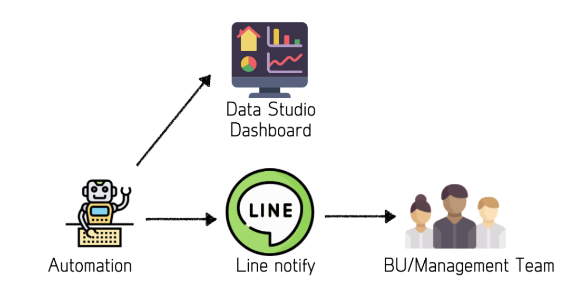
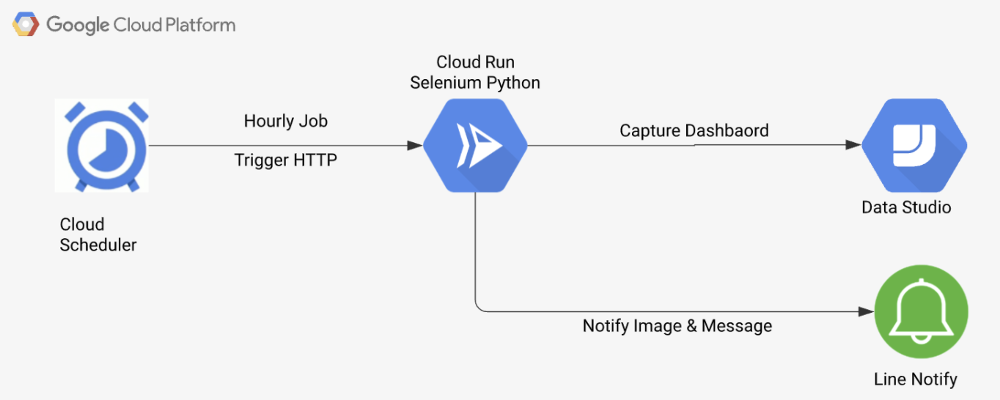

# Selenium Capture Datastudio
This git repository is from the [medium contents](https://punsiriboonyakiat.medium.com/%E0%B8%A1%E0%B8%B2%E0%B9%80%E0%B8%82%E0%B8%B5%E0%B8%A2%E0%B8%99-line-notify-%E0%B9%80%E0%B8%9E%E0%B8%B7%E0%B9%88%E0%B8%AD%E0%B8%AA%E0%B9%88%E0%B8%87-data-studio-dashboard-%E0%B8%94%E0%B9%89%E0%B8%A7%E0%B8%A2-cloud-run-%E0%B9%81%E0%B8%A5%E0%B8%B0-selenium-%E0%B8%81%E0%B8%99%E0%B9%80%E0%B8%96%E0%B8%AD%E0%B8%B0-75dbd288213f)


## Overview


## Architecture Diagram



## Configuration file for Line notification and Dashboard
*** Make sure you have the cookies file exported to private folder
</br>
Please edit file ``` private/config.json ``` before you run:
```
{
    "cookies_json_path": "private/datastudio.google.com.cookies.json",
    "report": {
        "id": "",
        "page": ""
    },
    "notify_token": ""
}
```
*** If you not provide cookies, Please make sure that the dashboard is set to embed and public
## How to test locally 

### Start web service with docker :
we have Docker installed locally, we can run this to test it:
```
docker build -t capture_dashboard .
docker run --rm -p 8080:8080 -e PORT=8080 capture_dashboard
```

### Test using curl command :
```
curl http://0.0.0.0:8080
```

## How to deploy to Cloud Run

To deploy please copy sample_setup.sh to private folder and edit your GCP project configuration.
```
cp deploy_scripts/sample_setup.sh  deploy_scripts/setup.sh
```

The runing the deploy script to deploy to your GCP project
```
sh deploy_scripts/cloud_run.sh
```
## Reference
* https://dev.to/googlecloud/using-headless-chrome-with-cloud-run-3fdp
* https://gist.github.com/ziadoz/3e8ab7e944d02fe872c3454d17af31a5